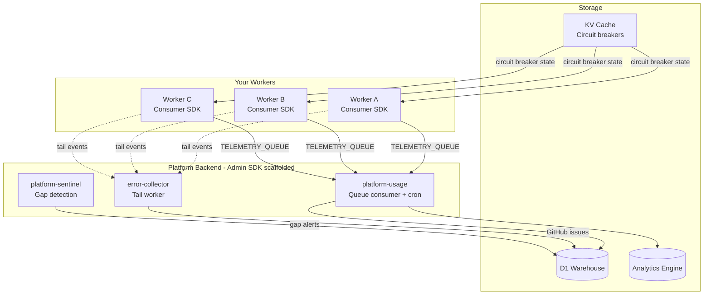

# Platform SDKs

**Automatic cost protection, circuit breaking, and error collection for Cloudflare Workers.**

[](https://www.npmjs.com/package/@littlebearapps/platform-consumer-sdk)
[](https://www.npmjs.com/package/@littlebearapps/platform-admin-sdk)
[](https://github.com/littlebearapps/platform-sdks/actions/workflows/ci.yml)
[](LICENSE)

---

## Why This Exists

In January 2026, a buggy deployment caused **$4,868 in unexpected Cloudflare charges** in 4 days. An infinite D1 write loop wrote 4.8 billion rows before anyone noticed.

We built this toolkit so it never happens again — and we're giving it away for free so it doesn't happen to you either.

## Which Package Do I Need?

| I want to... | Use this |
|--------------|----------|
| **Track costs and add circuit breakers** to my existing Workers | [Consumer SDK](#consumer-sdk) — install in each Worker |
| **Scaffold a backend** that processes telemetry, enforces budgets, and creates GitHub issues from errors | [Admin SDK](#admin-sdk) — run once to generate infrastructure |
| **Both** — full cost protection with a dashboard backend | Install both — the Consumer SDK sends data to the Admin SDK backend |

## Consumer SDK

**`@littlebearapps/platform-consumer-sdk`** — Lightweight library you install in each Cloudflare Worker project. Zero production dependencies. Ships raw TypeScript (bundled by wrangler).

```bash
npm install @littlebearapps/platform-consumer-sdk
```

> **tsconfig requirement**: Set `"moduleResolution": "bundler"` in your `tsconfig.json`. The SDK ships raw `.ts` source files that wrangler bundles at deploy time.

```typescript
import { withFeatureBudget, completeTracking, CircuitBreakerError } from '@littlebearapps/platform-consumer-sdk';

export default {
  async fetch(request: Request, env: Env, ctx: ExecutionContext) {
    const tracked = withFeatureBudget(env, 'myapp:api:main', { ctx });
    try {
      // All binding access is automatically tracked
      const result = await tracked.DB.prepare('SELECT * FROM users LIMIT 100').all();
      return Response.json(result);
    } catch (e) {
      if (e instanceof CircuitBreakerError) {
        return Response.json({ error: 'Feature temporarily disabled' }, { status: 503 });
      }
      throw e;
    } finally {
      ctx.waitUntil(completeTracking(tracked));
    }
  }
};
```

**What it tracks automatically**: D1 reads/writes, KV operations, R2 Class A/B, Workers AI requests, Vectorize queries/inserts, Queue messages, Durable Object requests with latency percentiles, Workflow invocations.

**What it protects against**: Three-tier circuit breakers (global kill switch > project-level > feature-level), budget enforcement via KV, and `CircuitBreakerError` thrown before expensive operations execute.

[Full Consumer SDK documentation](packages/consumer-sdk/README.md)

## Admin SDK

**`@littlebearapps/platform-admin-sdk`** — CLI scaffolder that generates backend infrastructure. Run once, then you own the code.

```bash
npx @littlebearapps/platform-admin-sdk my-platform
```

| Tier | Workers | What You Get | Est. Cost |
|------|---------|-------------|-----------|
| **Minimal** | 1 | Budget enforcement, circuit breakers, usage telemetry | ~$0/mo |
| **Standard** | 3 | + Error collection (auto GitHub issues), gap detection | ~$0/mo |
| **Full** | 8 | + AI pattern discovery, notifications, search, alerts | ~$5/mo |

[Full Admin SDK documentation](packages/admin-sdk/README.md)

## How They Work Together

The **Consumer SDK** (library) sends telemetry to the **Admin SDK** (backend infrastructure). Install the Consumer SDK in each of your application workers. The Admin SDK scaffolds the backend that processes that telemetry.



**Updating**: Consumer SDK updates are `npm update` — no migrations, no side effects. Admin SDK is scaffold-once; see its [upgrade guide](packages/admin-sdk/README.md#updating-your-platform).

## Consumer CI Workflow

Validate your SDK integration automatically in GitHub Actions:

```yaml
# .github/workflows/sdk-check.yml
name: SDK Check
on: [push, pull_request]
jobs:
  sdk-check:
    uses: littlebearapps/platform-sdks/.github/workflows/consumer-check.yml@main
    with:
      project-name: my-project
```

### What It Checks

| Check | What It Verifies |
|-------|-----------------|
| **SDK Installation** | `@littlebearapps/platform-consumer-sdk` is installed, reports version |
| **Wrangler Config** | `PLATFORM_CACHE` KV binding, `platform-telemetry` queue, `observability.enabled`, `tail_consumers` |
| **Budget Wrappers** | `withFeatureBudget` / `withCronBudget` / `withQueueBudget` calls exist in source |
| **Feature IDs** | IDs match `{project-name}:*:*` format |
| **Cost Safety** | No `.run()` inside loops, `INSERT` has `ON CONFLICT`, `SELECT` has `LIMIT`, no template literal SQL |
| **Middleware** | Circuit breaker middleware uses SDK import (not a local copy) |

### Workflow Inputs

| Input | Default | Description |
|-------|---------|-------------|
| `project-name` | *required* | Your project slug for feature ID validation |
| `node-version` | `20` | Node.js version |
| `wrangler-config-pattern` | `wrangler*.jsonc` | Glob for wrangler config files |
| `source-pattern` | `workers/**/*.ts,src/**/*.ts` | Comma-separated source file globs |
| `check-middleware` | `true` | Whether to check circuit breaker middleware |
| `strict-mode` | `false` | Fail on warnings (not just errors) |

## Documentation

### Guides

- [Architecture Concepts](docs/consumer-sdk/concepts.md) — How the proxy system works
- [Circuit Breakers](docs/consumer-sdk/circuit-breakers.md) — Three-tier protection hierarchy
- [Feature IDs](docs/consumer-sdk/feature-ids.md) — Naming conventions and budget registration
- [Telemetry](docs/consumer-sdk/telemetry.md) — Metrics format and flush lifecycle
- [Middleware](docs/consumer-sdk/middleware.md) — Project-level circuit breakers for Hono
- [Error Patterns](docs/consumer-sdk/patterns.md) — Static and dynamic transient error classification
- [Advanced Features](docs/consumer-sdk/advanced.md) — Tracing, logging, service client, AI Gateway, DO heartbeat
- [Troubleshooting](docs/consumer-sdk/troubleshooting.md) — Common issues and fixes

### Admin SDK Guides

- [Quickstart](docs/admin-sdk/quickstart.md) — Scaffold to deploy in 15 minutes
- [Tier Comparison](docs/admin-sdk/tiers.md) — What each tier generates
- [Upgrade Guide](docs/admin-sdk/upgrade-guide.md) — Three-way merge, adopt, and tier upgrades
- [CI Workflow Reference](docs/admin-sdk/ci-workflow.md) — consumer-check.yml deep dive

### Tutorials

- [Your First Protected Worker](docs/guides/first-worker.md) — End-to-end tutorial
- [Migrating from v0](docs/guides/migrating-from-v0.md) — Old package name migration

### External

- [Integration Checklist](https://docs.littlebearapps.com/platform-guides/sdk-integration-checklist/) — Full SDK setup guide
- [Claude Code Plugin](https://github.com/littlebearapps/platform-sdk-plugin) — Automated SDK enforcement in your editor

## Contributing

See [CONTRIBUTING.md](CONTRIBUTING.md) for development setup, code style, and how to submit changes.

## License

MIT — Built by [Little Bear Apps](https://littlebearapps.com). Free to use, modify, and distribute.
